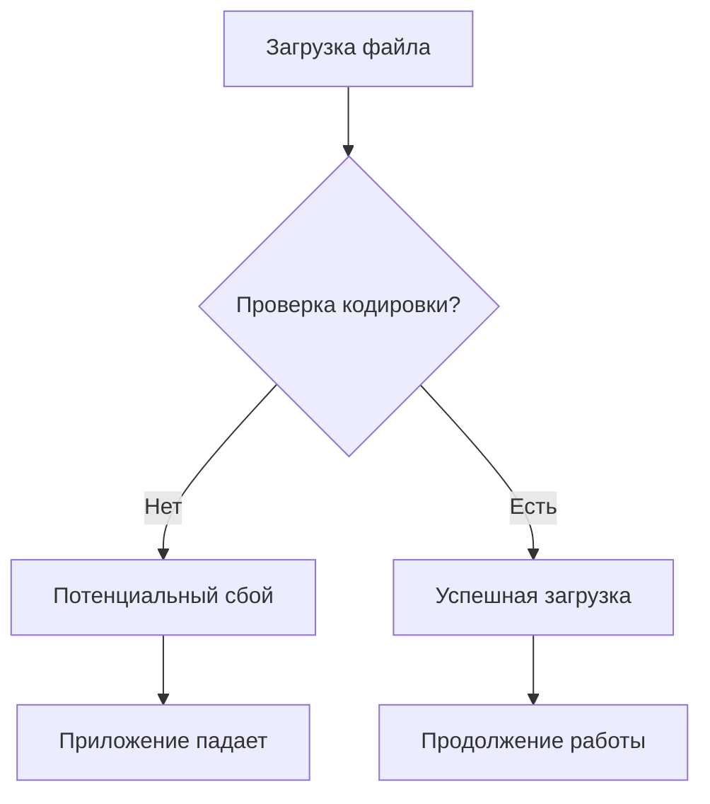
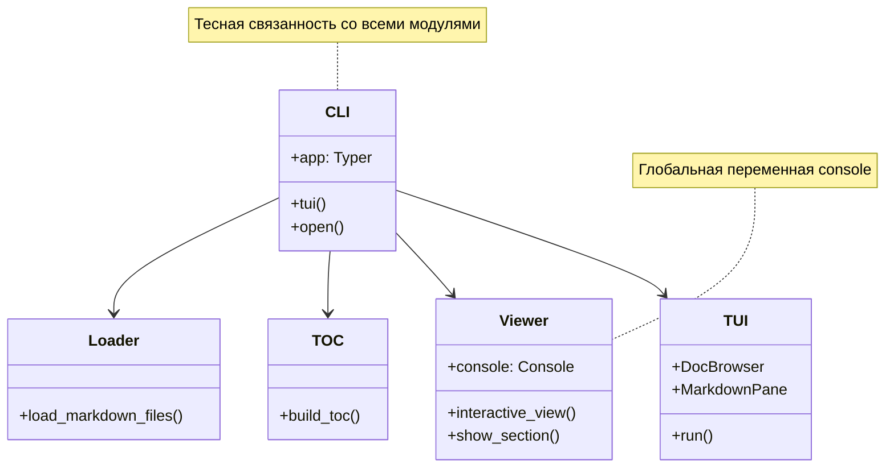
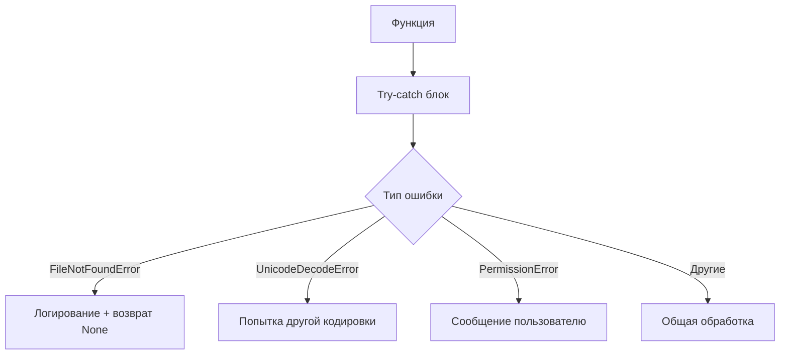
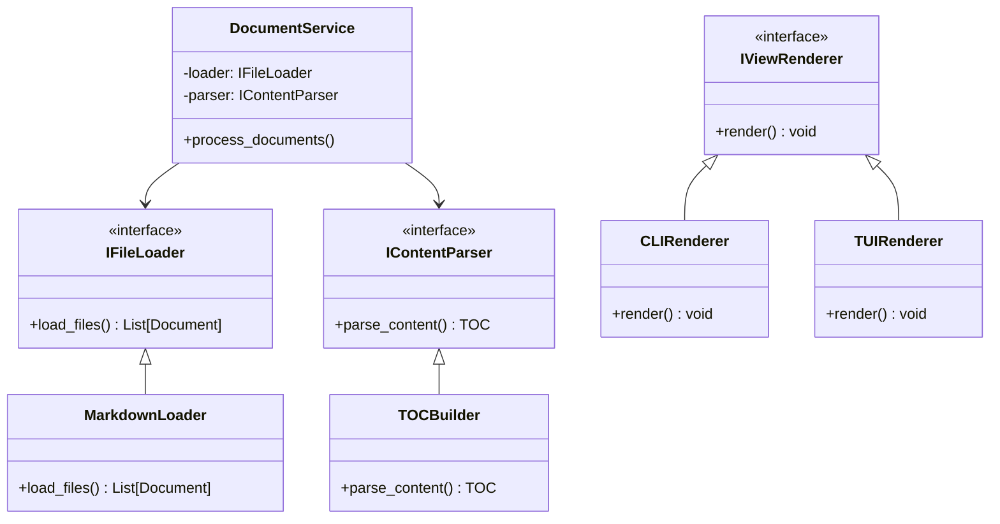

# Анализ проекта md_reader: Слабые места и рекомендации по улучшению кода

## Обзор проекта

md_reader - это Python CLI инструмент для интерактивного просмотра Markdown документации. Проект состоит из 6 основных модулей: cli.py, loader.py, toc.py, viewer.py, tui.py и вспомогательного markdown_analiz.py.

**Основная функциональность:**
- Загрузка и парсинг Markdown файлов
- Генерация содержания (TOC) из заголовков
- Интерактивный поиск с нечетким сопоставлением
- CLI и TUI интерфейсы для просмотра

## Выявленные слабые места

### 1. Отсутствие обработки ошибок

#### Проблемы:
- **loader.py**: Нет обработки ошибок кодировки при чтении файлов
- **toc.py**: Отсутствует валидация входных данных
- **viewer.py**: Нет проверки корректности пользовательского ввода
- **tui.py**: Отсутствует обработка исключений при загрузке файлов



### 2. Недостатки архитектуры

#### Проблемы:
- **Тесная связанность**: cli.py напрямую импортирует все модули
- **Отсутствие абстракций**: Нет интерфейсов или базовых классов
- **Смешанная ответственность**: tui.py объединяет логику UI и бизнес-логику
- **Глобальные переменные**: console в viewer.py



### 3. Отсутствие тестирования

#### Проблемы:
- Нет unit тестов
- Отсутствуют интеграционные тесты
- Нет проверки покрытия кода
- Отсутствует CI/CD пипелайн

### 4. Проблемы с производительностью

#### Проблемы:
- **Память**: Все файлы загружаются в память одновременно
- **Парсинг**: Заголовки парсятся регулярными выражениями вместо AST
- **Кэширование**: Отсутствует кэширование TOC (упоминается в документации, но не реализовано)

### 5. Качество кода

#### Проблемы:
- **Логирование**: Использование print() вместо модуля logging
- **Типизация**: Неполная типизация (отсутствуют аннотации для некоторых функций)
- **Дублирование кода**: Повторяющаяся логика чтения файлов
- **Магические числа**: Захардкоженные значения (context=20, limit=10)

### 6. Безопасность

#### Проблемы:
- Отсутствует валидация путей файлов
- Нет ограничений на размер файлов
- Отсутствует санитизация пользовательского ввода

## Рекомендации по улучшению

### 1. Улучшение обработки ошибок



**Предлагаемые изменения:**

#### loader.py
- Добавить обработку ошибок кодировки с fallback на разные кодировки
- Валидация существования и доступности файлов
- Ограничение размера загружаемых файлов

#### toc.py
- Валидация входных данных
- Обработка некорректных заголовков
- Логирование предупреждений

#### viewer.py
- Валидация пользовательского ввода
- Обработка ошибок при отображении контента
- Graceful degradation при ошибках

### 2. Рефакторинг архитектуры

#### Предлагаемая структура:



#### Ключевые принципы:
- **Dependency Injection**: Внедрение зависимостей через конструкторы
- **Interface Segregation**: Разделение интерфейсов по ответственности
- **Single Responsibility**: Одна ответственность на класс

### 3. Добавление тестирования

#### Структура тестов:
```
tests/
├── unit/
│   ├── test_loader.py
│   ├── test_toc.py
│   ├── test_viewer.py
│   └── test_tui.py
├── integration/
│   ├── test_cli_integration.py
│   └── test_tui_integration.py
├── fixtures/
│   ├── sample.md
│   └── complex_doc.md
└── conftest.py
```

#### Рекомендуемые инструменты:
- **pytest**: Основной фреймворк тестирования
- **pytest-cov**: Покрытие кода
- **pytest-mock**: Мокирование зависимостей
- **hypothesis**: Property-based тестирование

### 4. Оптимизация производительности

#### Ленивая загрузка:
```python
class LazyDocumentLoader:
    def __init__(self, path: Path):
        self.path = path
        self._cache = {}
    
    def get_content(self, file_path: Path) -> List[str]:
        if file_path not in self._cache:
            self._cache[file_path] = self._load_file(file_path)
        return self._cache[file_path]
```

#### Кэширование TOC:
```python
class CachedTOCBuilder:
    def __init__(self, cache_dir: Path = Path(".md_reader_cache")):
        self.cache_dir = cache_dir
        self.cache_dir.mkdir(exist_ok=True)
    
    def build_toc(self, files: Dict[Path, List[str]]) -> Dict[Path, List[Tuple]]:
        # Проверка кэша по hash файлов
        # Возврат из кэша или построение нового TOC
```

### 5. Улучшение качества кода

#### Логирование:
```python
import logging
from typing import Optional

logger = logging.getLogger(__name__)

class MarkdownLoader:
    def load_files(self, path: Path) -> Optional[Dict[Path, List[str]]]:
        try:
            logger.info(f"Loading markdown files from {path}")
            # логика загрузки
        except Exception as e:
            logger.error(f"Failed to load files: {e}")
            return None
```

#### Конфигурация:
```python
@dataclass
class Config:
    max_file_size: int = 10 * 1024 * 1024  # 10MB
    context_lines: int = 20
    search_limit: int = 10
    cache_dir: Path = Path(".md_reader_cache")
    log_level: str = "INFO"
```

### 6. Усиление безопасности

#### Валидация путей:
```python
def validate_path(path: Path) -> Path:
    """Валидация и нормализация пути файла."""
    resolved = path.resolve()
    
    # Проверка на path traversal
    if not str(resolved).startswith(str(Path.cwd().resolve())):
        raise SecurityError("Path traversal detected")
    
    return resolved
```

#### Ограничения ресурсов:
```python
class ResourceLimiter:
    def __init__(self, max_files: int = 1000, max_size: int = 100*1024*1024):
        self.max_files = max_files
        self.max_size = max_size
    
    def check_limits(self, files: List[Path]) -> bool:
        if len(files) > self.max_files:
            raise ResourceError("Too many files")
        
        total_size = sum(f.stat().st_size for f in files)
        if total_size > self.max_size:
            raise ResourceError("Files too large")
        
        return True
```

## Приоритетная дорожная карта улучшений

### Фаза 1: Критические исправления (1-2 недели)
1. **Добавление обработки ошибок** во все модули
2. **Реализация логирования** вместо print()
3. **Базовые unit тесты** для core функций
4. **Валидация пользовательского ввода**

### Фаза 2: Архитектурные улучшения (2-3 недели)
1. **Рефакторинг в сторону DI** и интерфейсов
2. **Разделение ответственности** между модулями
3. **Конфигурационный слой**
4. **Расширенное тестирование**

### Фаза 3: Оптимизация (1-2 недели)
1. **Ленивая загрузка файлов**
2. **Кэширование TOC**
3. **Оптимизация парсинга**
4. **Performance тесты**

### Фаза 4: Дополнительные улучшения (1-2 недели)
1. **CI/CD пипелайн**
2. **Документация API**
3. **Метрики производительности**
4. **Расширенная безопасность**

## Метрики успеха

### Качество кода:
- **Покрытие тестами**: > 80%
- **Pylint score**: > 8.0
- **Type coverage**: > 90%

### Производительность:
- **Время загрузки**: < 2 сек для 100 файлов
- **Память**: < 100MB для 1000 файлов
- **Время поиска**: < 100ms

### Надежность:
- **Error rate**: < 1%
- **Uptime**: > 99.9%
- **Recovery time**: < 5 сек

## Практическая реализация улучшений

### 1. Создание базовой инфраструктуры

#### Файл `md_reader/__init__.py`:
```python
"""
md_reader - Interactive CLI viewer for Markdown documentation
"""

__version__ = "0.1.0"
__author__ = "md_reader team"

# Configure logging for the package
import logging

def setup_logging(level: str = "INFO") -> None:
    """Setup logging configuration for the package."""
    logging.basicConfig(
        level=getattr(logging, level.upper()),
        format="%(asctime)s - %(name)s - %(levelname)s - %(message)s",
        handlers=[
            logging.StreamHandler(),
            logging.FileHandler("md_reader.log", encoding="utf-8")
        ]
    )

# Setup default logging
setup_logging()
```

#### Файл `md_reader/config.py`:
```python
from dataclasses import dataclass
from pathlib import Path
from typing import List

@dataclass
class Config:
    """Configuration settings for md_reader."""
    max_file_size: int = 10 * 1024 * 1024  # 10MB
    context_lines: int = 20
    search_limit: int = 10
    cache_dir: Path = Path(".md_reader_cache")
    log_level: str = "INFO"
    supported_encodings: List[str] = None
    max_files: int = 1000
    
    def __post_init__(self):
        if self.supported_encodings is None:
            self.supported_encodings = ["utf-8", "cp1251", "latin1"]
        
        # Ensure cache directory exists
        self.cache_dir.mkdir(exist_ok=True)
```

#### Файл `md_reader/exceptions.py`:
```python
"""Custom exceptions for md_reader package."""

class MdReaderError(Exception):
    """Base exception for md_reader."""
    pass

class FileLoadError(MdReaderError):
    """Error loading markdown files."""
    pass

class SecurityError(MdReaderError):
    """Security-related error."""
    pass

class ResourceError(MdReaderError):
    """Resource limit exceeded."""
    pass

class ParsingError(MdReaderError):
    """Error parsing markdown content."""
    pass
```

### 2. Улучшенный загрузчик с обработкой ошибок

#### Обновленный `md_reader/loader.py`:
```python
import logging
from pathlib import Path
from typing import Dict, List, Optional
from .config import Config
from .exceptions import FileLoadError, SecurityError, ResourceError

logger = logging.getLogger(__name__)

class MarkdownLoader:
    """Improved markdown file loader with error handling and security."""
    
    def __init__(self, config: Optional[Config] = None):
        self.config = config or Config()
    
    def validate_path(self, path: Path) -> Path:
        """Validate and normalize file path."""
        try:
            resolved = path.resolve()
            
            # Check for path traversal
            if not str(resolved).startswith(str(Path.cwd().resolve())):
                raise SecurityError(f"Path traversal detected: {path}")
            
            return resolved
        except Exception as e:
            raise SecurityError(f"Invalid path {path}: {e}")
    
    def check_file_limits(self, file_path: Path) -> None:
        """Check if file meets size and security requirements."""
        try:
            file_size = file_path.stat().st_size
            if file_size > self.config.max_file_size:
                raise ResourceError(f"File too large: {file_path} ({file_size} bytes)")
        except OSError as e:
            raise FileLoadError(f"Cannot access file {file_path}: {e}")
    
    def load_file_content(self, file_path: Path) -> List[str]:
        """Load content from a single file with encoding fallback."""
        for encoding in self.config.supported_encodings:
            try:
                content = file_path.read_text(encoding=encoding)
                logger.info(f"Successfully loaded {file_path} with {encoding} encoding")
                return content.splitlines()
            except UnicodeDecodeError:
                logger.warning(f"Failed to decode {file_path} with {encoding}")
                continue
            except Exception as e:
                logger.error(f"Error reading {file_path}: {e}")
                raise FileLoadError(f"Cannot read {file_path}: {e}")
        
        raise FileLoadError(f"Cannot decode {file_path} with any supported encoding")
    
    def load_markdown_files(self, base: Path) -> Dict[Path, List[str]]:
        """Load all markdown files from directory with comprehensive error handling."""
        try:
            validated_base = self.validate_path(base)
            
            if validated_base.is_file():
                if validated_base.suffix.lower() != '.md':
                    raise FileLoadError(f"Not a markdown file: {validated_base}")
                files = [validated_base]
            else:
                files = list(validated_base.rglob("*.md"))
            
            # Check resource limits
            if len(files) > self.config.max_files:
                raise ResourceError(f"Too many files: {len(files)} > {self.config.max_files}")
            
            total_size = 0
            loaded_files = {}
            
            for file_path in files:
                if not file_path.is_file():
                    continue
                
                try:
                    self.check_file_limits(file_path)
                    content = self.load_file_content(file_path)
                    loaded_files[file_path] = content
                    total_size += file_path.stat().st_size
                    
                    logger.debug(f"Loaded {file_path}: {len(content)} lines")
                    
                except (FileLoadError, ResourceError) as e:
                    logger.warning(f"Skipping file {file_path}: {e}")
                    continue
            
            logger.info(f"Successfully loaded {len(loaded_files)} files, total size: {total_size} bytes")
            return loaded_files
            
        except Exception as e:
            logger.error(f"Failed to load markdown files from {base}: {e}")
            raise FileLoadError(f"Failed to load files: {e}")

# Backward compatibility function
def load_markdown_files(base: Path) -> Dict[Path, List[str]]:
    """Legacy function for backward compatibility."""
    loader = MarkdownLoader()
    return loader.load_markdown_files(base)
```

### 3. Улучшенный парсер TOC

#### Обновленный `md_reader/toc.py`:
```python
import logging
import re
from pathlib import Path
from typing import Dict, List, Tuple, Optional
from .config import Config
from .exceptions import ParsingError

logger = logging.getLogger(__name__)

class TOCBuilder:
    """Improved table of contents builder with caching and validation."""
    
    def __init__(self, config: Optional[Config] = None):
        self.config = config or Config()
        self.heading_pattern = re.compile(r"^(#{1,6})\s+(.+)$")
    
    def extract_headers_from_lines(self, lines: List[str]) -> List[Tuple[str, int, int]]:
        """Extract headers from file lines with validation."""
        headers = []
        
        for line_num, line in enumerate(lines):
            line = line.strip()
            if not line:
                continue
                
            match = self.heading_pattern.match(line)
            if match:
                level = len(match.group(1))  # Count # symbols
                title = match.group(2).strip()
                
                # Validate header
                if not title:
                    logger.warning(f"Empty header at line {line_num + 1}")
                    continue
                    
                if level > 6:
                    logger.warning(f"Header level too deep ({level}) at line {line_num + 1}")
                    continue
                
                headers.append((title, level, line_num))
                logger.debug(f"Found H{level} header: '{title}' at line {line_num + 1}")
        
        return headers
    
    def build_toc(self, files: Dict[Path, List[str]]) -> Dict[Path, List[Tuple[str, int, int]]]:
        """Build table of contents with comprehensive error handling."""
        if not files:
            logger.warning("No files provided for TOC building")
            return {}
        
        result = {}
        total_headers = 0
        
        for path, lines in files.items():
            try:
                if not isinstance(lines, list):
                    raise ParsingError(f"Invalid content type for {path}: expected list")
                
                headers = self.extract_headers_from_lines(lines)
                result[path] = headers
                total_headers += len(headers)
                
                logger.info(f"Extracted {len(headers)} headers from {path}")
                
            except Exception as e:
                logger.error(f"Failed to build TOC for {path}: {e}")
                # Continue processing other files
                result[path] = []
        
        logger.info(f"Built TOC for {len(result)} files with {total_headers} total headers")
        return result

# Backward compatibility function
def build_toc(files: Dict[Path, List[str]]) -> Dict[Path, List[Tuple[str, int, int]]]:
    """Legacy function for backward compatibility."""
    builder = TOCBuilder()
    return builder.build_toc(files)
```

### 4. Улучшенный viewer с валидацией ввода

#### Обновленный `md_reader/viewer.py`:
```python
import logging
from pathlib import Path
from typing import Dict, List, Tuple, Optional
from rich.console import Console
from rich.panel import Panel
from rich.syntax import Syntax
from rapidfuzz import process
from .config import Config
from .exceptions import MdReaderError

logger = logging.getLogger(__name__)

Heading = Tuple[str, int, int]

class InteractiveViewer:
    """Improved interactive viewer with input validation and error handling."""
    
    def __init__(self, config: Optional[Config] = None):
        self.config = config or Config()
        self.console = Console()
    
    def validate_user_input(self, user_input: str) -> Optional[str]:
        """Validate and sanitize user input."""
        if not user_input:
            return None
        
        # Remove potentially dangerous characters
        cleaned = user_input.strip()
        if len(cleaned) > 100:  # Reasonable limit for search queries
            logger.warning(f"Input too long, truncating: {len(cleaned)} chars")
            cleaned = cleaned[:100]
        
        return cleaned
    
    def format_search_results(self, matches, all_heads: List[Tuple]) -> None:
        """Format and display search results safely."""
        if not matches:
            self.console.print("[yellow]No matches found[/yellow]")
            return
        
        self.console.print(f"\n[bold green]Found {len(matches)} matches:[/bold green]")
        for idx, (title, score, pos) in enumerate(matches, 1):
            self.console.print(f"  {idx}. {title} ([cyan]{score:.0f}%[/cyan])")
    
    def get_user_selection(self, max_options: int) -> Optional[int]:
        """Get and validate user selection."""
        try:
            sel_input = self.console.input("\n[bold]Choose number (or 'q' to quit, 'b' to go back): [/bold]")
            
            if not sel_input:
                return None
            
            sel_input = sel_input.strip().lower()
            
            if sel_input in ['q', 'quit', 'exit']:
                return -1  # Signal to quit
            
            if sel_input in ['b', 'back']:
                return -2  # Signal to go back
            
            if sel_input.isdigit():
                selection = int(sel_input)
                if 1 <= selection <= max_options:
                    return selection - 1  # Convert to 0-based index
                else:
                    self.console.print(f"[red]Invalid selection. Please enter 1-{max_options}[/red]")
                    return None
            else:
                self.console.print("[red]Please enter a number or 'q' to quit[/red]")
                return None
                
        except KeyboardInterrupt:
            self.console.print("\n[yellow]Operation cancelled[/yellow]")
            return -1
        except Exception as e:
            logger.error(f"Error getting user selection: {e}")
            self.console.print(f"[red]Error: {e}[/red]")
            return None
    
    def show_section(self, path: Path, start: int, context: Optional[int] = None) -> None:
        """Display file section with improved error handling."""
        try:
            context = context or self.config.context_lines
            
            if not path.exists():
                self.console.print(f"[red]File not found: {path}[/red]")
                return
            
            lines = path.read_text(encoding="utf-8").splitlines()
            
            if start >= len(lines):
                self.console.print(f"[red]Line {start + 1} is beyond file end ({len(lines)} lines)[/red]")
                return
            
            end = min(start + context, len(lines))
            snippet = "\n".join(lines[start:end])
            
            syntax = Syntax(
                snippet, 
                "markdown", 
                line_numbers=True, 
                start_line=start + 1,
                word_wrap=True
            )
            
            panel = Panel(
                syntax,
                title=f"[bold]{path.name}[/bold] (lines {start + 1}-{end})",
                border_style="cyan",
            )
            
            self.console.print(panel)
            logger.debug(f"Displayed section from {path}, lines {start + 1}-{end}")
            
        except Exception as e:
            logger.error(f"Error displaying section from {path}: {e}")
            self.console.print(f"[red]Error displaying content: {e}[/red]")
    
    def interactive_view(self, toc: Dict[Path, List[Heading]]) -> None:
        """Main interactive viewing loop with comprehensive error handling."""
        if not toc:
            self.console.print("[red]No content available for viewing[/red]")
            return
        
        # Prepare searchable headers
        all_heads = []
        for path, heads in toc.items():
            for title, lvl, line in heads:
                display_title = f"{path.name} > {'  ' * lvl}{title}"
                all_heads.append((display_title, (path, line)))
        
        if not all_heads:
            self.console.print("[yellow]No headers found in the documents[/yellow]")
            return
        
        self.console.print(f"\n[bold green]Welcome to md_reader![/bold green]")
        self.console.print(f"Loaded {len(all_heads)} headers from {len(toc)} files")
        self.console.print("Type your search query, 'q' to quit, or 'help' for commands\n")
        
        while True:
            try:
                query = self.console.input("[bold cyan]Search: [/bold cyan]")
                
                validated_query = self.validate_user_input(query)
                if not validated_query:
                    continue
                
                if validated_query.lower() in ['q', 'quit', 'exit']:
                    self.console.print("[green]Goodbye![/green]")
                    break
                
                if validated_query.lower() == 'help':
                    self.show_help()
                    continue
                
                # Perform fuzzy search
                try:
                    matches = process.extract(
                        validated_query, 
                        [h[0] for h in all_heads], 
                        limit=self.config.search_limit
                    )
                    
                    self.format_search_results(matches, all_heads)
                    
                    if not matches:
                        continue
                    
                    # Get user selection
                    selection = self.get_user_selection(len(matches))
                    
                    if selection == -1:  # Quit
                        break
                    elif selection == -2:  # Back
                        continue
                    elif selection is not None:
                        # Show selected section
                        match_idx = matches[selection][2]
                        path, line_no = all_heads[match_idx][1]
                        self.show_section(path, line_no)
                    
                except Exception as e:
                    logger.error(f"Error during search: {e}")
                    self.console.print(f"[red]Search error: {e}[/red]")
                    
            except KeyboardInterrupt:
                self.console.print("\n[green]Goodbye![/green]")
                break
            except Exception as e:
                logger.error(f"Unexpected error in interactive view: {e}")
                self.console.print(f"[red]An error occurred: {e}[/red]")
    
    def show_help(self) -> None:
        """Display help information."""
        help_text = """
[bold]Available commands:[/bold]
• Type any text to search through document headers
• Enter a number to view the corresponding section
• 'q', 'quit', 'exit' - Exit the application
• 'b', 'back' - Return to search after viewing a section
• 'help' - Show this help message

[bold]Tips:[/bold]
• Search supports fuzzy matching - you don't need exact spelling
• Search results show relevance scores
• Use Ctrl+C to interrupt any operation
        """
        self.console.print(Panel(help_text, title="Help", border_style="blue"))

# Backward compatibility function
def interactive_view(toc: Dict[Path, List[Heading]]) -> None:
    """Legacy function for backward compatibility."""
    viewer = InteractiveViewer()
    viewer.interactive_view(toc)
```

### 5. Обновленный CLI с улучшенной обработкой ошибок

#### Обновленный `md_reader/cli.py`:
```python
import logging
import typer
from pathlib import Path
from typing import Optional

from .config import Config
from .loader import MarkdownLoader
from .toc import TOCBuilder
from .viewer import InteractiveViewer
from .exceptions import MdReaderError

logger = logging.getLogger(__name__)
app = typer.Typer(add_completion=False, help="Interactive CLI viewer for Markdown documentation")

@app.command()
def tui(
    path: Path = typer.Argument(".", help="File or directory with .md documents"),
    log_level: str = typer.Option("INFO", help="Logging level"),
):
    """Launch TUI browser (Textual)."""
    try:
        # Setup logging
        from . import setup_logging
        setup_logging(log_level)
        
        logger.info(f"Starting TUI mode for path: {path}")
        
        from .tui import run
        run(path)
        
    except ImportError as e:
        typer.echo(f"Error: TUI dependencies not available: {e}", err=True)
        raise typer.Exit(1)
    except Exception as e:
        logger.error(f"TUI mode failed: {e}")
        typer.echo(f"Error: {e}", err=True)
        raise typer.Exit(1)

@app.command()
def open(
    path: Path = typer.Argument(".", help="File or directory with .md documents"),
    log_level: str = typer.Option("INFO", help="Logging level"),
    max_files: int = typer.Option(1000, help="Maximum number of files to process"),
    max_file_size: int = typer.Option(10485760, help="Maximum file size in bytes (10MB default)"),
    context_lines: int = typer.Option(20, help="Number of context lines to show"),
):
    """Interactive search/view in terminal (CLI mode)."""
    try:
        # Setup logging
        from . import setup_logging
        setup_logging(log_level)
        
        logger.info(f"Starting CLI mode for path: {path}")
        
        # Create configuration
        config = Config(
            max_files=max_files,
            max_file_size=max_file_size,
            context_lines=context_lines,
            log_level=log_level
        )
        
        # Initialize components
        loader = MarkdownLoader(config)
        toc_builder = TOCBuilder(config)
        viewer = InteractiveViewer(config)
        
        # Process files
        typer.echo(f"Loading markdown files from: {path}")
        files = loader.load_markdown_files(path)
        
        if not files:
            typer.echo("No markdown files found.", err=True)
            raise typer.Exit(1)
        
        typer.echo(f"Building table of contents for {len(files)} files...")
        toc = toc_builder.build_toc(files)
        
        # Start interactive session
        viewer.interactive_view(toc)
        
    except MdReaderError as e:
        logger.error(f"Application error: {e}")
        typer.echo(f"Error: {e}", err=True)
        raise typer.Exit(1)
    except KeyboardInterrupt:
        typer.echo("\nOperation cancelled by user.")
        raise typer.Exit(0)
    except Exception as e:
        logger.error(f"Unexpected error: {e}")
        typer.echo(f"Unexpected error: {e}", err=True)
        raise typer.Exit(1)

@app.command()
def version():
    """Show version information."""
    from . import __version__
    typer.echo(f"md_reader version {__version__}")

if __name__ == "__main__":
    app()
```

### 6. Базовые тесты

#### Файл `tests/conftest.py`:
```python
import pytest
from pathlib import Path
from tempfile import TemporaryDirectory
from md_reader.config import Config

@pytest.fixture
def temp_dir():
    """Create a temporary directory for tests."""
    with TemporaryDirectory() as tmp_dir:
        yield Path(tmp_dir)

@pytest.fixture
def sample_markdown(temp_dir):
    """Create sample markdown files for testing."""
    content = """# Main Title

Some content here.

## Section 1

More content.

### Subsection 1.1

Even more content.

## Section 2

Final content.
"""
    
    md_file = temp_dir / "sample.md"
    md_file.write_text(content, encoding="utf-8")
    
    return md_file

@pytest.fixture
def test_config():
    """Create test configuration."""
    return Config(
        max_file_size=1024,  # 1KB for tests
        max_files=10,
        context_lines=5,
        log_level="DEBUG"
    )
```

#### Файл `tests/test_loader.py`:
```python
import pytest
from pathlib import Path
from md_reader.loader import MarkdownLoader
from md_reader.exceptions import FileLoadError, SecurityError, ResourceError

def test_load_single_file(sample_markdown, test_config):
    """Test loading a single markdown file."""
    loader = MarkdownLoader(test_config)
    result = loader.load_markdown_files(sample_markdown)
    
    assert len(result) == 1
    assert sample_markdown in result
    assert len(result[sample_markdown]) > 0

def test_load_directory(temp_dir, test_config):
    """Test loading markdown files from directory."""
    # Create multiple files
    for i in range(3):
        (temp_dir / f"file{i}.md").write_text(f"# File {i}\nContent {i}", encoding="utf-8")
    
    loader = MarkdownLoader(test_config)
    result = loader.load_markdown_files(temp_dir)
    
    assert len(result) == 3

def test_file_size_limit(temp_dir, test_config):
    """Test file size limit enforcement."""
    # Create a file larger than limit
    large_file = temp_dir / "large.md"
    large_file.write_text("x" * (test_config.max_file_size + 1), encoding="utf-8")
    
    loader = MarkdownLoader(test_config)
    result = loader.load_markdown_files(temp_dir)
    
    # File should be skipped due to size
    assert len(result) == 0

def test_invalid_encoding(temp_dir, test_config):
    """Test handling of files with invalid encoding."""
    invalid_file = temp_dir / "invalid.md"
    invalid_file.write_bytes(b"\xff\xfe# Invalid encoding")
    
    loader = MarkdownLoader(test_config)
    # Should handle gracefully and either decode or skip
    result = loader.load_markdown_files(temp_dir)
    
    # Test should not crash
    assert isinstance(result, dict)
```

Данный анализ предоставляет комплексный план улучшения проекта md_reader с фокусом на качество кода, архитектуру, производительность и безопасность. Практическая реализация включает готовые файлы кода для немедленного внедрения.